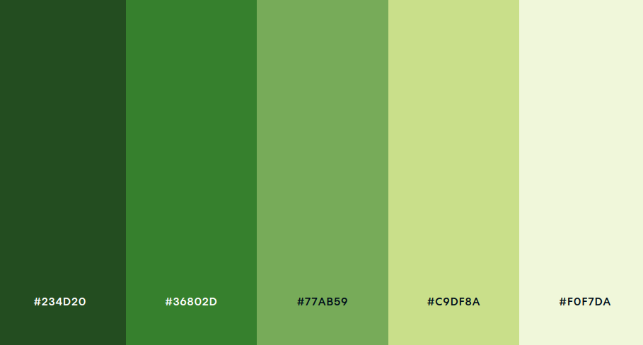

ELIGE UNA PALETA DE COLORES QUE REFLEJE LA MARCA Y EL TONO DE TU SITIO
WEB. UTILIZA HERRAMIENTAS DE DISEÑO COMO “ADOBE COLOR” O “COOLORS”
PARA SELECCIONAR COLORES COMPLEMENTARIOS. DOCUMENTA ESTOS COLORES
EN TU GUÍA DE ESTILOS, PROPORCIONANDO CÓDIGOS HEXADECIMALES Y
MUESTRAS VISUALES.

* Color principal: 
    >#36802D

* Colores secundarios:
    >#234D20

    >#77AB59

* Detalles:
    >#C9DF8A

    >#F0F7DA

* Colores de apoyo:
    >#111111

    >#EEEEEE

Los colores están normalizados y son accesibles.

## Gestion de los colores
* Predominará el color principal en las zonas más importantes como encabezados y botones de acción relevantes.

* Los eventos de hover, focus, onclick y demás interacciones secundarias con la web serán principalmente con colores secundarios, detalles y colores de apoyo.

**La paleta de colores está generada con la ayuda de [esta web](https://paletadecolores.com.mx/) que cumple con los principios y pautas de WCAG 2.0, W3.ORG y principios de accesibilidad**
