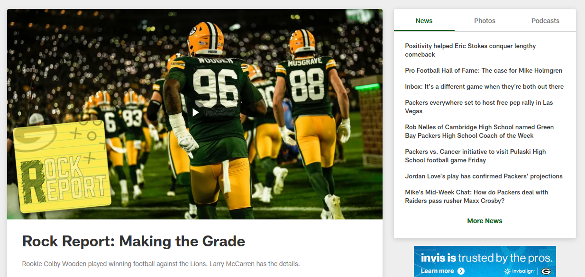

ELIGE UNA O DOS FUENTES DE TEXTO QUE SEAN LEGIBLES Y COMPLEMENTEN LA
PERSONALIDAD DE TU SITIO WEB. DEFINE TAMAÑOS DE FUENTE PARA TÍTULOS,
PÁRRAFOS Y OTROS ELEMENTOS. INCLUYE EJEMPLOS DE CÓMO SE VERÁN LAS
FUENTES EN TU GUÍA.

# Fuente y tipografía para la web

## Fuente principal y secundarias de seguridad
All-ProSans, Helvetica, sans-serif, Arial.

[Información sobre la fuente principal All-ProSans](https://positype.com/custom/nfl-all-pro-sans)

Al ser una fuente de pago, usaremos las demás citadas de momento.

## Tamaños, colores y otras características
* Títulos principales: Size 24px, Weight 500, Line Height 34px, Color #151515.
* Títulos secundarios: Size 14px, Weight 400, Line Height 20px, Color #151515.
* Párrafos: Size 14px, Weight 400, Line Height 20px, Color #333333
* Textos de detalles (footer): Size 12px, Weight 400, Line Height 17px, Color #ffffff (sobre fondo oscuro)

## Ejemplo de diseño

