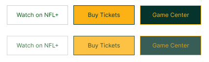

DEFINE CÓMO SE VERÁN LOS BOTONES Y LOS ENLACES EN TU SITIO WEB. ESTO
INCLUYE COLORES DE FONDO, COLORES DE TEXTO Y EFECTOS DE HOVER
(CAMBIOS CUANDO EL USUARIO PASA EL CURSOR SOBRE ELLOS).

## Botones
Botones principales

La primera fila son los botones en su estado normal
 
La segunda fila son los botones con el evento hover

Los colores serán:
* Botón blanco: Fondo: #FFFFFF, Borde: #CCCCCC, Letras: #085C16
* Botón oro: Fondo: #FCB215, Borde: #085C16, Letras: #06342D
* Botón verde: Fondo: #06342D, Borde: #FCB215, Letras: #FCB215

El tamaño standard para el boton será de 125px de ancho y 40px de alto.
Reduciremos los tamaños según vayamos ajustando la web con responsive a tamaños móviles.

 
Para el efecto de hover, simplemente pondremos la totalidad del botón a 80% de opacidad. De esa manera se percibirá la interacción con el botón

  

## Links
Para los links usaremos letra en negrita, sin decoración de texto adicional

Los colores principales a usar para los links serán:
* #151515
* #333333
* #757575

Los colores facilitados son tonalidades de grises. Es posible usar puntualmente los colores de los botones para links.

El tamaño de los links será igual al del texto donde esté contenido, de tal modo que no llame demasiado la atención.

Para el efecto hover de los links haremos la misma estrategia que para los botones, es decir, opacidad al 80%. En caso de tener un color muy claro aplicaremos el efecto contrario.

## Cursor
El cursor default (flecha del ratón habitual) será el default también en la web.
A la hora de hacer hover en botones o en links se cambiará al icono de la mano (pointer). De esta manera se queda claro que el elemento es para clicar sobre el.