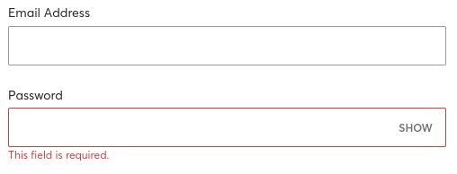

# Punto principal
ES IMPORTANTE ESTABLECER UNA JERARQUÍA VISUAL PARA QUE LOS VISITANTES
SEPAN QUÉ ELEMENTOS SON MÁS IMPORTANTES. ESTO IMPLICA DEFINIR ESTILOS
PARA ENCABEZADOS, SUBTÍTULOS, LISTAS Y OTROS ELEMENTOS DE TEXTO.

## Desglose
1. DEFINE LOS ESTILOS DE ENCABEZADOS (H1, H2, H3, ETC.) Y SUS TAMAÑOS
DE FUENTE CORRESPONDIENTES.

  * h1: 
     - Family: All-ProSans, Helvetica,, Arial, sans-serif.
     - Style: normal
     - Weight: 700
     - Size: 48px
     - Line Height: 67px
     - Color: #151515
  
  * h2: 
     - Family: All-ProSans, Helvetica,, Arial, sans-serif.
     - Style: normal
     - Weight: 700
     - Size: 40px
     - Line Height: 51px
     - Color: #151515
  
  * h3: 
     - Family: All-ProSans, Helvetica,, Arial, sans-serif.
     - Style: normal
     - Weight: 400
     - Size: 32px
     - Line Height: 35px
     - Color: #333333
  * h4: 
     - Family: All-ProSans, Helvetica,, Arial, sans-serif.
     - Style: normal
     - Weight: 400
     - Size: 24px
     - Line Height: 19px
     - Color: #333333
  * h5: 
     - Family: All-ProSans, Helvetica,, Arial, sans-serif.
     - Style: normal
     - Weight: 400
     - Size: 20px
     - Line Height: 18px
     - Color: #515151
  * h6: 
     - Family: All-ProSans, Helvetica,, Arial, sans-serif.
     - Style: normal
     - Weight: 400
     - Size: 16px
     - Line Height: 18px
     - Color: #515151

 

2. ESTABLECE ESTILOS PARA LOS SUBTÍTULOS Y PÁRRAFOS, INCLUYENDO TAMAÑOS DE FUENTE Y ESPACIADO.
* span: 
     - Family: All-ProSans, Helvetica,, Arial, sans-serif.
     - Style: normal
     - Weight: 500
     - Size: 13px
     - Line Height: 18px
     - Color: #333333

* p: 
     - Family: All-ProSans, Helvetica,, Arial, sans-serif.
     - Style: normal
     - Weight: 400
     - Size: 14px
     - Line Height: 20px
     - Color: #151515

         (Se pondrá la letra con un mayor tamaño si la sub-página está destinada a noticias)

 

3. PROPORCIONA ESTILOS PARA ELEMENTOS DE LISTA (VIÑETAS Y NUMERACIÓN) Y CITAS.
* Las viñetas, numeraciones, listas, ... irán sin decoración y con formato igual a la etiqueta span.
* La estructura típica de elementos se generará en grid-container o flex-container y elementos tipo cartas.
* Existirán varios sliders horizontales con navegación manual y automática
* Si existiesen citas se generarán con la etiqueta <q> y se dejarán sus parámetros por defecto. Se ajustará el tamaño si es demasiado distinto de los elementos adyacentes. Debe de dar sensación de integración y no se pretenderá que destaque.

 

4. ESPECIFICA CÓMO SE DEBEN TRATAR LOS CAMPOS OBLIGATORIOS Y CÓMO DEBEN DESTACARSE.

 
Cada campo irá con un recuadro y la descripción arriba. En caso de ser requerido y no ingresar información, saltará un texto debajo del input con el mensaje "This field is required" en rojo y texto pequeño.   También se remarcará el input con un borde en rojo para indicar que falta información en ese campo.

 

5. DOCUMENTA CÓMO SE DEBEN OPTIMIZAR LOS FORMULARIOS PARA LA ENTRADA DE DATOS EN DISPOSITIVOS MÓVILES Y TABLETAS.
* Se dispondrá de una presentación en columnas de manera que la estructura sea:
  * Label
  * Input
  * (Texto adicional dinámico rojo, en caso que sea necesario)
* Al final y siguiendo con esta disposición estará el submit y la aceptación de términos, cookies, etc.
* Siguiendo con la implementación de web responsive, esta optimización será dinámica y flexible.